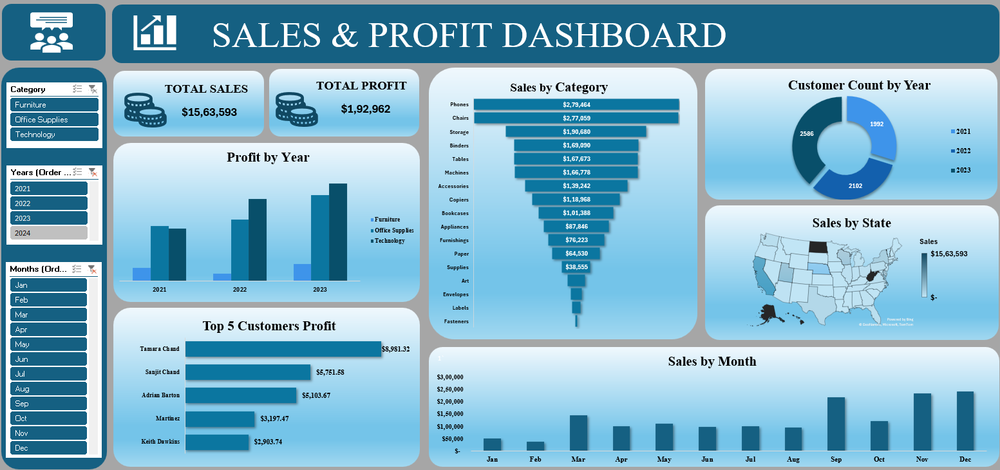

# 📊 Sales & Profit Dashboard (Excel Project)

## 📌 Overview
This project is an **interactive Excel Dashboard** designed to analyze and visualize sales & profit performance across different categories, states, and customers.  

The dashboard provides business insights at a glance, making it easier to track growth, identify top customers, and compare trends over time.  

---

## 🔹 Key Insights
- ✅ Total Sales & Profit overview  
- ✅ Year-wise Profit Analysis  
- ✅ Sales by Category (Funnel Chart)  
- ✅ Sales by State (Map Visualization)  
- ✅ Customer Growth by Year (Donut Chart)  
- ✅ Top 5 Customers by Profit  
- ✅ Monthly Sales Trend  

---

## 🛠 Tools & Skills Used
- Microsoft Excel  
- Pivot Tables & Pivot Charts  
- Slicers & Filters  
- Funnel, Donut, Map, and Column Charts  
- Dashboard Formatting & Design  

---

## 🎯 Learning Outcomes
This project helped me strengthen:  
- Data Visualization & Storytelling  
- Dashboard Building in Excel  
- Business Data Analysis Skills  
- Presenting actionable insights  

---

## 📸 Dashboard Preview

---

## 🚀 How to Use
1. Download the Excel file from this repository.  
2. Open in Microsoft Excel (desktop recommended).  
3. Use slicers to filter by **Year, Month, or Category** to interact with the data.  

---

## 🔗 Connect with Me
- [LinkedIn](https://www.linkedin.com/in/vanshika-bindra-435493358/)  

---

✨ Feedback and suggestions are most welcome!  

